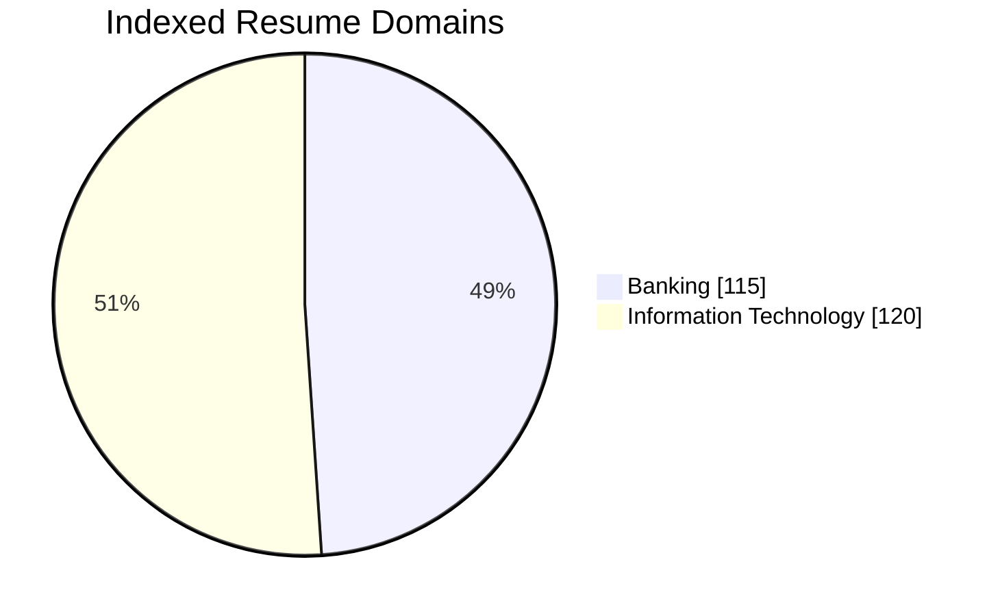
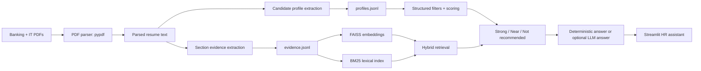
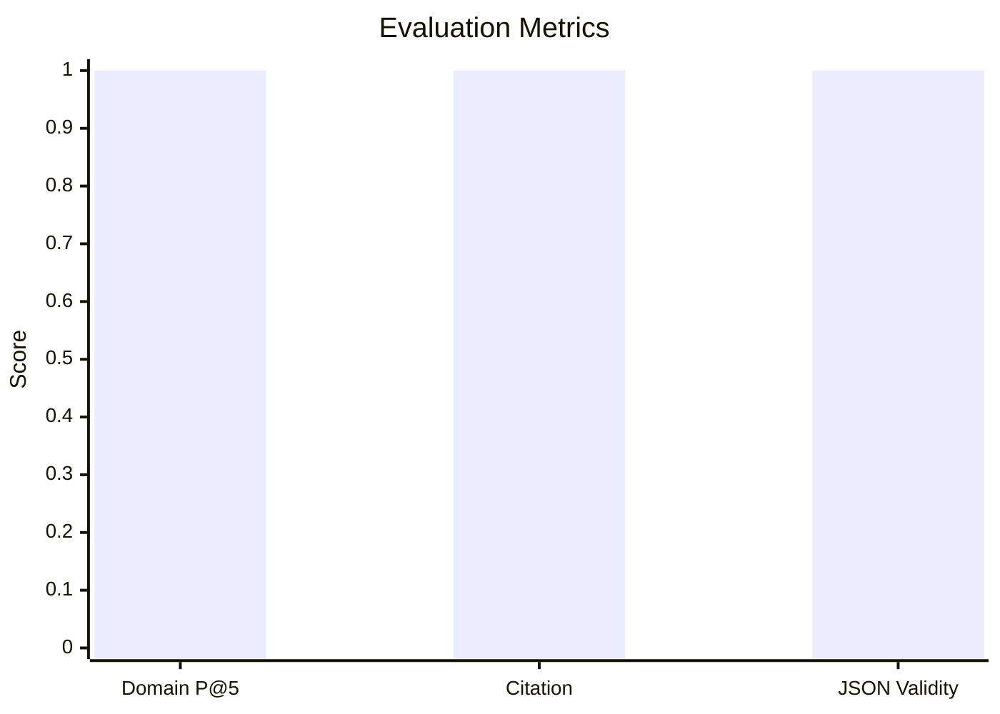

# HR Resume RAG Assistant

## 1. Project Summary

This project implements a chat-first HR assistant for resume screening over the Kaggle Resume Dataset. It focuses on the `BANKING` and `INFORMATION-TECHNOLOGY` domains and indexes only those two resume groups.

The main design choice is:

> Use structured candidate profiles plus section-level evidence retrieval, not generic semantic chunking.

Resumes are already semi-structured. A typical CV has summary, skills, experience, education, and certifications. Instead of splitting resumes into arbitrary chunks first, the system extracts a candidate profile and keeps natural resume sections as evidence. This makes the answers more useful for HR users because the assistant can explain:

- why a candidate matches
- why a candidate is only a near match
- which required skills are missing
- what evidence from the CV supports the recommendation
- what HR should verify manually

The app supports both deterministic RAG output and optional LLM-written answers through the OpenAI SDK-compatible DeepSeek API.

## 2. HR Workflow Research and Product Assumptions

This section captures the product and architecture thinking behind the implementation.

### 2.1 User Context

The target user is an HR or recruiting user with limited technical background. They may not know how to write structured filters, vector queries, or Boolean search. They are more likely to ask in natural language:

- "Find IT candidates with backend, SQL, and 1+ year experience."
- "Is this candidate weak for Power BI?"
- "Why did you recommend this candidate?"
- "Show me stretch candidates if they are close enough."

Therefore, the product should feel like an assistant, not only a search form.

### 2.2 Core Product Assumptions

| Assumption | Product decision |
| --- | --- |
| HR wants explanations, not just ranked IDs | Return matched skills, missing skills, recommendation, and evidence |
| CVs are already structured | Use candidate profile + section evidence instead of generic semantic chunks |
| Hiring criteria are sometimes flexible | Support both flexible mode and strict mode |
| Acronyms matter in Banking and IT | Add abbreviation glossary and BM25 lexical retrieval |
| LLMs can write better summaries but may hallucinate | Keep retrieval/ranking deterministic and give the LLM only grounded evidence |
| Company names are anonymized in this dataset | Do not use company prestige as a ranking signal |

### 2.3 Design Tradeoffs

| Decision | Why |
| --- | --- |
| Structured profiles first | HR queries usually ask about candidate-level suitability, not isolated paragraphs |
| Section evidence second | Evidence snippets should come from natural CV sections such as Skills and Experience |
| Hybrid FAISS + BM25 | Embeddings help broad phrasing; BM25 protects exact acronyms like KYC, AML, SQL, BE, FE |
| Heuristic MVP + optional LLM | The app works without API cost, but can use DeepSeek when keys are available |
| Optional LlamaParse | pypdf works for the current PDFs; LlamaParse is reserved for scanned/complex PDFs |
| Flexible default | Real recruiters often want close candidates, not only perfect keyword matches |
| Strict toggle | Some requirements are true hard filters, such as regulatory skill or minimum years |

### 2.4 HR Reasoning Model

The assistant does not treat every requirement as binary. It uses three buckets:

- **Strong match**: the CV clearly supports domain, required skills, and years.
- **Near match**: the CV misses something measurable but has compensating evidence.
- **Not recommended**: the CV misses core requirements and does not have enough compensation.

Example:

> If HR asks for 5 years and the candidate has 3 years, the candidate should not be called a strong match. But if the candidate has highly aligned projects, strong tools, and relevant domain exposure, the assistant can show them as a near match with a clear warning.

### 2.5 Why Prestige and Scope Signals Matter

Prestige or high-scope experience can be useful when a candidate misses a measurable requirement but may still deserve review. For example, a candidate with 3 years of experience instead of 5 may still be a reasonable near match if the CV shows unusually strong compensating evidence:

- experience at a recognized bank, fintech, or technology company
- senior or high-responsibility title for the experience level
- ownership of regulated, production, or large-scale systems
- domain-aligned projects that directly match the role
- certifications or repeated evidence across multiple experience bullets

This signal should never turn a missing hard requirement into a strong match by itself. It is best used to explain why a candidate is a **near match** rather than ignored completely.

For the current Kaggle resumes, many employer names are anonymized as `Company Name`, so the implementation does not use company prestige as a primary scoring feature. Instead, it uses more reliable compensation signals available in the text: seniority, project ownership, certifications, tool overlap, and domain alignment. For uploaded real-world CVs with visible employer names, prestige/company-scope could be added as an optional, transparent signal.

### 2.6 Edge-Case Policies From Brainstorming

| Edge case | Policy |
| --- | --- |
| 3 years vs 5 years requested | Flexible mode can show near match; strict mode excludes |
| Skill appears only in education | Lower confidence and encourage verification |
| Candidate has right skills but wrong domain | Domain filter blocks if domain is explicit |
| Candidate has right domain but missing core tool | Near match or not recommended depending on compensation |
| Missing/unclear dates | Show uncertainty; strict mode excludes if minimum years required |
| `BE` abbreviation | Warn that it may mean Backend Engineering or Bachelor of Engineering |
| `B.E.` in education context | Treat as degree, not backend |
| Lowercase `be` | Ignore as abbreviation |
| `PowerBI`, `Power BI`, `BI`, dashboarding | Normalize as related evidence |
| Scanned PDF | Mark low text and optionally use LlamaParse |
| LLM API unavailable | Fall back to deterministic answer |

### 2.7 Risks and Mitigations

| Risk | Mitigation |
| --- | --- |
| LLM hallucination | LLM sees only retrieved matches/evidence and is instructed not to invent facts |
| Keyword stuffing in resumes | Evidence is shown so HR can inspect whether the skill appears in real work context |
| Acronym ambiguity | Glossary + clarification notes |
| Incorrect years estimate | Years are labeled as estimates and uncertain fields are exposed |
| Over-filtering good candidates | Flexible mode surfaces near matches |
| Under-filtering hard requirements | Strict mode excludes missing/uncertain hard criteria |

## 3. Technology Stack

| Layer | Tooling |
| --- | --- |
| UI | Streamlit |
| CLI | Python `argparse` |
| PDF parsing | `pypdf` local parser |
| Optional enhanced parsing | LlamaParse, enabled only when `LLAMA_CLOUD_API_KEY` exists |
| Profile extraction | Heuristic baseline, optional LLM profile extraction |
| LLM integration | OpenAI SDK-compatible DeepSeek endpoint from `example_LLM.py` |
| Embedding retrieval | `sentence-transformers/all-MiniLM-L6-v2` |
| Vector index | FAISS |
| Lexical retrieval | BM25 through `rank-bm25` |
| Data processing | Python dataclasses, JSONL artifacts, pandas-compatible outputs |
| Evaluation | Built-in HR-style query suite |

## 4. Dataset Scope

Only these folders are indexed:

- `data/BANKING`
- `data/INFORMATION-TECHNOLOGY`

Current built artifacts:

| Check | Result |
| --- | ---: |
| Total indexed PDFs | 235 |
| Banking PDFs | 115 |
| Information Technology PDFs | 120 |
| Evidence blocks | 1,490 |
| Low-text PDFs detected | 0 |
| Candidate profiles | 235 |

No other Kaggle categories are used.

### Data Distribution



```text
PDF count by domain
BANKING                  | ####################### 115
INFORMATION-TECHNOLOGY   | ######################## 120

Artifact volume
Candidate profiles       | ####################### 235
Evidence blocks          | ###################################################################################################################################################### 1490
Low-text PDFs            | 0
```

The numeric source for these charts is also saved in `docs/artifact_summary.csv`.

## 5. System Workflow



### Workflow Details

1. **Ingestion**
   - Discover PDFs only from the Banking and IT folders.
   - Parse each PDF with `pypdf`.
   - Mark PDFs as low-text if parsing returns too little text.
   - Optionally use LlamaParse for low-text or complex documents.

2. **Candidate Profile Extraction**
   - Produce one profile per resume.
   - Store structured fields such as domain, role signals, skills, tools, education, certifications, estimated years of experience, summary, evidence references, and uncertain fields.
   - Current built artifacts use the heuristic baseline.
   - LLM profile extraction is implemented and tested, but requires rebuilding with `--use-llm-profile`.

3. **Evidence Extraction**
   - Keep natural CV sections: `Summary`, `Skills`, `Experience`, `Education`, `Certifications`, or page fallback.
   - These sections are used for citations and explanation.

4. **Hybrid Retrieval**
   - Structured filters handle domain, candidate IDs, strict mode, and minimum years.
   - FAISS retrieves semantically similar evidence.
   - BM25 improves exact matches for acronyms and skills such as `KYC`, `AML`, `SQL`, `BE`, `FE`, and `Power BI`.

5. **Answer Generation**
   - Deterministic mode composes answers from ranked matches and evidence.
   - LLM mode sends only grounded matches and evidence to DeepSeek, then asks the model to write an HR-friendly answer without inventing facts.

## 6. Why Not Generic Semantic Chunking?

Generic semantic chunking is useful for long unstructured documents, but resumes are short and already organized. In this domain, arbitrary semantic chunks can split skill lists or experience bullets in unnatural places.

This project uses:

- one structured profile per candidate
- section/page evidence blocks for citation
- hybrid candidate ranking over structured fields and evidence

This gives HR users better explanations than raw chunk search.

## 7. Match Logic

The assistant returns candidates in three buckets.

| Bucket | Meaning |
| --- | --- |
| Strong match | Meets domain, required skills, and measurable requirements with clear evidence |
| Near match | Misses a measurable requirement, but has compensating evidence |
| Not recommended | Misses core requirements and lacks enough compensation |

The app has two screening modes:

- **Flexible mode**: default. Shows near matches with explicit caveats.
- **Strict mode**: excludes candidates that miss hard requirements.

Example near-match reasoning:

> Candidate is below the requested 20-year threshold, estimated around 12.5 years. However, AML and KYC are both present with compliance/operations evidence, so this is a near match rather than a full match.

## 8. Abbreviation and Alias Handling

The system includes a glossary for HR, IT, and Banking abbreviations. It normalizes terms before filtering and ranking.

| Input | Canonical meaning |
| --- | --- |
| BE | Backend Engineering, unless education context suggests Bachelor of Engineering |
| B.E. | Bachelor of Engineering / education context |
| FE | Frontend Engineering |
| AI | Artificial Intelligence |
| ML | Machine Learning |
| DS | Data Science |
| DE | Data Engineering |
| QA | Quality Assurance |
| BA | Business Analyst, but can mean Bachelor of Arts in education |
| RM | Relationship Management |
| KYC | Know Your Customer |
| AML | Anti-Money Laundering |
| PowerBI / Power BI / BI / dashboarding | Power BI / business intelligence evidence |

Important behavior:

- Uppercase `BE` in an IT query is treated as possibly backend, but the assistant warns that it is ambiguous.
- `B.E.` or education context is treated as degree-related.
- Lowercase `be` is not treated as backend.
- Banking acronyms like `KYC` and `AML` are exact-match sensitive, which is why BM25 was added.

## 9. Example Prompts and Outputs

These examples were tested after building the artifacts.

### 9.1 Banking Query Without LLM

Command:

```powershell
python -m hr_resume_rag.cli ask "Find banking candidates with KYC and AML experience" --top-k 2
```

Output excerpt:

```text
Screening mode: flexible. Found 2 candidate(s).

1. Candidate 11065180 - Strong match (BANKING, 12.5 years)
Matched: Domain: BANKING, AML, KYC
Recommendation: Compliance is a strong match because the CV supports the main requested criteria.
Evidence: [Experience p.1] Managed a team ... approved due diligence reviews ...

2. Candidate 28989677 - Strong match (BANKING, 5 years)
Matched: Domain: BANKING, AML, KYC
Evidence: [Experience p.1] Senior compliance officer AML/CFT ... OFAC ... Suspicious Activity Reporting ...
```

This is deterministic output. It is reliable and grounded, but less conversational.

### 9.2 Banking Query With LLM

Command:

```powershell
python -m hr_resume_rag.cli ask "Find banking candidates with KYC and AML experience" --top-k 2 --use-llm
```

Output excerpt:

```text
Recruiter Summary - Banking KYC/AML Candidates

Search: Banking candidates with KYC and AML skills
Interpreted criteria: Domain = Banking, required skills = AML, KYC

Rank 1: Resume ID 11065180 - Strong Match
Why this candidate fits:
- Deep banking domain experience in compliance/operations.
- Explicitly lists KYC and AML in the skills section and demonstrates them in practice.

Rank 2: Resume ID 28989677 - Strong Match
Why this candidate fits:
- Direct AML/KYC compliance role with hands-on experience in sanctions and compliance.
- CV summary explicitly positions the candidate as a KYC/AML specialist.
```

The LLM does not retrieve independently. It only rewrites the retrieved profiles and evidence into a more HR-friendly answer.

### 9.3 IT Query Without Abbreviation

Command:

```powershell
python -m hr_resume_rag.cli ask "Find IT backend candidates with SQL and at least 1 year experience" --top-k 3
```

Output excerpt:

```text
1. Candidate 15651486 - Strong match (INFORMATION-TECHNOLOGY, 16.4 years)
Matched: Domain: INFORMATION-TECHNOLOGY, Backend Engineering, SQL, Experience: 16.4 years >= 1

2. Candidate 16186411 - Strong match (INFORMATION-TECHNOLOGY, 2 years)
Matched: Domain: INFORMATION-TECHNOLOGY, Backend Engineering, SQL, Experience: 2 years >= 1
```

### 9.4 IT Query With Abbreviation

Command:

```powershell
python -m hr_resume_rag.cli ask "Find BE candidates with Java and SQL" --top-k 3
```

Output excerpt:

```text
Clarification note: BE is ambiguous: Backend Engineering, Bachelor of Engineering.
The assistant uses context but HR should confirm if ranking depends on it.

1. Candidate 83816738 - Strong match (INFORMATION-TECHNOLOGY, 4.2 years)
Matched: Domain: INFORMATION-TECHNOLOGY, Java, SQL, Backend Engineering

2. Candidate 16186411 - Strong match (INFORMATION-TECHNOLOGY, 2 years)
Matched: Domain: INFORMATION-TECHNOLOGY, Java, SQL, Backend Engineering
```

The abbreviation is handled, but the uncertainty is surfaced to HR.

### 9.5 Banking Near-Match Query

Command:

```powershell
python -m hr_resume_rag.cli ask "Find banking candidates with KYC and AML and at least 20 years experience" --top-k 5
```

Output excerpt:

```text
1. Candidate 77156708 - Near match (BANKING, 40.9 years)
Matched: Domain: BANKING, AML, Experience: 40.9 years >= 20
Missing/gap: KYC

3. Candidate 11065180 - Near match (BANKING, 12.5 years)
Matched: Domain: BANKING, AML, KYC
Missing/gap: Experience below target: 12.5 years vs 20
```

This demonstrates flexible screening: candidates can still be shown if they have strong compensating evidence.

### 9.6 Strict Mode

Command:

```powershell
python -m hr_resume_rag.cli ask "Find banking candidates with KYC and AML and at least 20 years experience" --strict --top-k 5
```

Output excerpt:

```text
No candidates were found for this query in strict mode.
Try relaxing the domain, years, or required skills.
```

Strict mode excludes candidates when hard requirements are missing or cannot be proven.

## 10. Edge Cases Documented and Tested

| Edge case | Handling |
| --- | --- |
| 3 years experience but HR asks for 5 | Flexible mode can return as near match if skills/projects compensate; strict mode excludes |
| Candidate has skill but below required years | Near match with explicit experience gap |
| Candidate has unclear years | Near match in flexible mode; excluded in strict mode if minimum years is required |
| `BE` abbreviation | Interpreted from context, warning shown |
| `B.E.` degree | Treated as education context, not backend |
| Lowercase `be` | Ignored as abbreviation |
| `KYC` / `AML` acronyms | BM25 helps preserve exact lexical matches |
| `PowerBI` vs `Power BI` vs dashboarding | Normalized into Power BI / BI evidence |
| Skill only in education/coursework | Reduced confidence through uncertainty notes when detectable |
| Right skills but wrong domain | Domain filter prevents cross-domain results when domain is specified |
| Right domain but missing core skill | Candidate becomes near match or not recommended |
| Company prestige | Not used as a primary signal because many resumes anonymize company as `Company Name` |
| Scanned / low-text PDF | Detected by low text length; LlamaParse can be used as fallback |
| Uploaded CV | App can parse one uploaded PDF and estimate whether it is closer to Banking, IT, or unclear |
| LLM unavailable or invalid key | System falls back to deterministic grounded answer |

## 11. Evaluation Results

Command:

```powershell
python -m hr_resume_rag.cli evaluate
```

Latest evaluation:

| Metric | Result |
| --- | ---: |
| Query count | 15 |
| Domain precision at 5 | 1.0 |
| Citation coverage | 1.0 |
| JSON validity rate | 1.0 |
| Average latency | 14.144 seconds |
| Profile count | 235 |

Field coverage:

| Field | Coverage |
| --- | ---: |
| `resume_id` | 1.0 |
| `domain` | 1.0 |
| `skills` | 0.949 |
| `role_signals` | 0.919 |
| `years_experience_estimate` | 0.974 |
| `experience_summary` | 1.0 |

The evaluation suite includes Banking queries, IT queries, abbreviation queries, near-match cases, missing-skill explanations, and candidate comparison style prompts.

### Evaluation Graphs



```text
Field coverage
resume_id                 | ################################################## 1.000
domain                    | ################################################## 1.000
skills                    | ###############################################--- 0.949
role_signals              | ##############################################---- 0.919
years_experience_estimate | ################################################-- 0.974
experience_summary        | ################################################## 1.000
```

The numeric source for these charts is also saved in `docs/evaluation_summary.csv`.

## 12. LLM and LlamaParse Status

### LLM

LLM integration is implemented and tested through the OpenAI SDK-compatible DeepSeek API.

Tested:

```text
LLM_AVAILABLE True
MODEL deepseek-v4-flash
BASE_URL https://api.deepseek.com
RESULT FLASH_OK
```

Also tested:

- LLM-written answer with `--use-llm`
- Single-resume LLM profile extraction, which returned `extraction_method = llm+heuristic`

### LLM Validation Suite

Additional flash-model tests were run with `deepseek-v4-flash`.

| Test | Prompt / action | Result |
| --- | --- | --- |
| Direct smoke | `Reply exactly: FLASH_OK` | Returned `FLASH_OK` |
| Banking grounded answer | `Find banking candidates with KYC and AML experience` | Returned two Banking strong matches with KYC/AML evidence |
| IT abbreviation answer | `Find BE candidates with Java and SQL` | Preserved the `BE` ambiguity warning and returned IT backend matches |
| Banking near-match answer | `Find banking candidates with KYC and AML and at least 20 years experience` | Returned near matches with explicit missing KYC or experience gap |
| LLM profile extraction | One IT resume profile extraction | Returned `llm+heuristic`, role `Information Technology Technician I`, 64 skills, 40 tools, 19.0 estimated years, 1 uncertainty note |

The LLM is deliberately not the retrieval engine. It only receives retrieved candidates, match buckets, missing requirements, and evidence snippets. This keeps the answer grounded while making the final response easier for HR to read.

The main built artifact currently uses heuristic profiles because rebuilding all 235 profiles with LLM calls costs more time/API usage. To rebuild with LLM extraction:

```powershell
python -m hr_resume_rag.cli build --use-llm-profile
```

### LlamaParse

LlamaParse support is implemented as an optional parser enhancement. It is useful if future uploaded resumes are scanned or have complex layouts.

To enable during build:

```powershell
$env:LLAMA_CLOUD_API_KEY="..."
python -m hr_resume_rag.cli build --use-llama-parse
```

For the current 235 PDFs, `pypdf` parsed all documents with no low-text failures, so LlamaParse was not necessary for the baseline artifact.

## 13. How to Run

Install dependencies:

```powershell
python -m pip install -r requirements.txt
```

Create `.env`:

```env
DEEPSEEK_API_KEY=your_key_here
LLM_BASE_URL=https://api.deepseek.com
DEEPSEEK_MODEL=deepseek-v4-flash
```

An example environment file is provided at `.env-example`.

Build artifacts:

```powershell
python -m hr_resume_rag.cli build
```

Ask from CLI:

```powershell
python -m hr_resume_rag.cli ask "Find banking candidates with KYC and AML experience"
python -m hr_resume_rag.cli ask "Find BE candidates with Java and SQL"
python -m hr_resume_rag.cli ask "Find banking candidates with KYC and AML experience" --use-llm
```

Run Streamlit:

```powershell
streamlit run app.py
```

Evaluate:

```powershell
python -m hr_resume_rag.cli evaluate
```

## 14. Important Files

| File | Purpose |
| --- | --- |
| `app.py` | Streamlit HR chat assistant |
| `hr_resume_rag/cli.py` | CLI for build, ask, evaluate, and serve |
| `hr_resume_rag/parsing.py` | PDF parsing with pypdf and optional LlamaParse |
| `hr_resume_rag/extraction.py` | Candidate profile extraction |
| `hr_resume_rag/retrieval.py` | Hybrid retrieval and match ranking |
| `hr_resume_rag/glossary.py` | Abbreviation and alias normalization |
| `hr_resume_rag/llm.py` | DeepSeek/OpenAI-compatible LLM wrapper |
| `hr_resume_rag/evaluation.py` | Built-in evaluation suite |
| `docs/report.tex` | LaTeX report source |
| `docs/demo_script.md` | Short video demo script |

## 15. Short Video Demo Plan

A 2-3 minute demo is enough.

1. **Open with the README** and say the tool is a chat-first HR resume RAG assistant for Banking and IT resumes.
2. **Show the Streamlit app** at `http://localhost:8501`.
3. **Point to runtime status** in the sidebar: LLM configured, parser mode, retrieval as FAISS + BM25.
4. **Run a Banking query**: `Find banking candidates with KYC and AML experience`.
5. **Open one candidate expander** and show matched skills, missing requirements, recommendation, and evidence.
6. **Run an abbreviation query**: `Find BE candidates with Java and SQL`; point out the `BE` ambiguity warning.
7. **Run a near-match query**: `Find banking candidates with KYC and AML and at least 20 years experience`; show near-match gaps.
8. **Toggle strict mode** and rerun the near-match query to show hard filtering.
9. **Close with artifacts/evaluation**: mention 235 PDFs indexed, 115 Banking, 120 IT, 1,490 evidence blocks, domain precision@5 = 1.0, citation coverage = 1.0.

Suggested recording tools:

- Windows: Xbox Game Bar (`Win + G`) or Clipchamp screen recorder.
- Browser-only: Loom.
- Open-source: OBS Studio.

Keep the video focused on the HR workflow instead of code internals.
